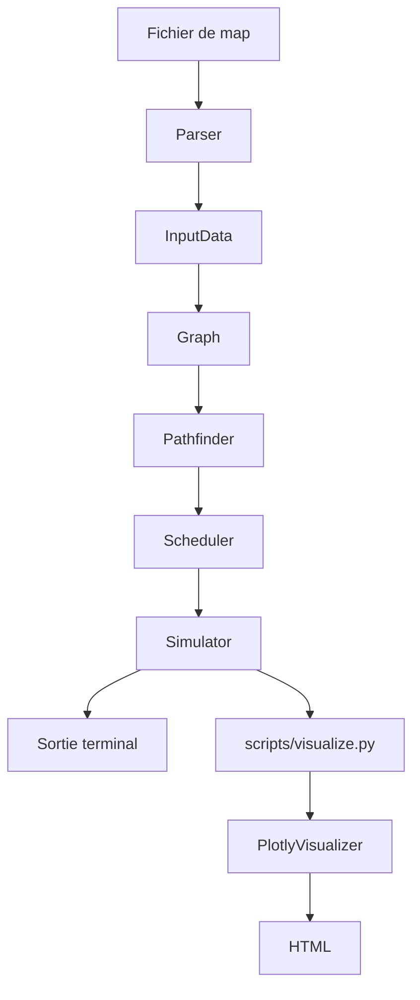
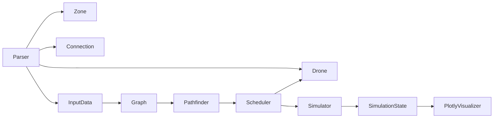

# Architecture et pipeline complet

## 1. Vue d'ensemble du flux

Le programme suit ce chemin logique :



Ce pipeline est réel dans le dépôt : `main.py` orchestre les étapes, puis `scripts/visualize.py` réutilise les mêmes briques pour produire une vue graphique.

## 2. Rôle du point d'entrée

### `main.py`

`main.py` est le chef d'orchestre.

Il lit l'argument de ligne de commande, vérifie que le fichier existe, appelle le parser, construit le graphe, vérifie qu'un chemin existe entre le start hub et le end hub, crée les drones, initialise le pathfinder et le scheduler, exécute la simulation, puis affiche la sortie et le résumé.

Le code montre clairement les grandes étapes métier et les erreurs qui peuvent interrompre le flux : parsing, construction du graphe, planification et simulation.

## 3. Pipeline détaillé

### Étape 1 : fichier de map

- Fichier impliqué : la map passée en argument, par exemple `maps/easy/01_linear_path.txt`.
- Données reçues : texte brut.
- Étape suivante : lecture et découpage ligne par ligne dans `core/parser.py`.

### Étape 2 : lecture et validation

- Fichier principal : `core/parser.py`.
- Classe principale : `Parser`.
- Données reçues : le contenu texte de la map.
- Données produites : un objet `InputData` avec `num_drones`, `zones`, `connections`, `start_zone`, `end_zone`.
- Étape suivante : construction des objets métier et du graphe.

Le parser ignore les lignes vides et les commentaires, détecte les déclarations `nb_drones`, crée les `Zone` et `Connection`, puis vérifie les erreurs structurelles comme les doublons, les zones inconnues ou l'absence de start/end.

### Étape 3 : création des objets

- Fichiers impliqués : `models/zone.py`, `models/connection.py`, `models/drone.py`, `models/enums.py`.
- Classes principales : `Zone`, `Connection`, `Drone`, `ZoneType`, `ZoneCategory`, `DroneState`.
- Données reçues : les valeurs extraites par le parser.
- Données produites : des objets Python typés et validés.
- Étape suivante : intégration dans le graphe.

### Étape 4 : construction du graphe

- Fichier principal : `core/graph.py`.
- Classe principale : `Graph`.
- Données reçues : dictionnaire de zones et liste de connexions.
- Données produites : une structure d'adjacence et une table de correspondance des connexions.
- Étape suivante : recherche des chemins.

Le graphe permet d'interroger rapidement les voisins d'une zone et de récupérer une connexion donnée dans les deux sens.

### Étape 5 : recherche des chemins

- Fichier principal : `core/pathfinder.py`.
- Classe principale : `Pathfinder`.
- Méthode importante : `find_shortest_path`.
- Données reçues : zone source et zone destination.
- Données produites : un `PathfindingResult` avec la liste ordonnée des zones du chemin et son coût total.
- Étape suivante : attribution de chemins aux drones.

Le pathfinder utilise Dijkstra avec une file de priorité. Il tient compte du coût d'entrée dans les zones, en particulier pour les zones restricted et priority.

### Étape 6 : attribution des chemins

- Fichier principal : `core/scheduler.py`.
- Classe principale : `Scheduler`.
- Méthode importante : `schedule_all_drones`.
- Données reçues : la liste de drones, le start, le end, et les chemins possibles fournis par le pathfinder.
- Données produites : une suite de `SchedulingResult`, un par tour.
- Étape suivante : exécution du tour par tour.

Le scheduler distribue les drones sur un petit ensemble de chemins candidats, puis arbitre les mouvements en fonction des capacités, des conflits et des priorités de progression.

### Étape 7 : simulation tour par tour

- Fichier principal : `core/simulator.py`.
- Classe principale : `Simulator`.
- Données reçues : le graphe, le scheduler, la liste des drones et les noms des zones de départ et d'arrivée.
- Données produites : un `SimulationState`, des métriques, une sortie texte et éventuellement une sortie de capacité.
- Étape suivante : affichage terminal et visualisation.

Le simulateur exécute la boucle de simulation, accumule les lignes de sortie, enregistre les résultats de chaque tour et calcule les métriques finales.

### Étape 8 : génération de la sortie terminal

- Fichier principal : `main.py`.
- Données reçues : l'état final de simulation.
- Données produites : une sortie lisible sur stdout avec les mouvements des drones, éventuellement les capacités, puis un résumé.
- Étape suivante : utilisation éventuelle du visualiseur.

### Étape 9 : visualisation graphique

- Fichier d'entrée : `scripts/visualize.py`.
- Fichier de rendu : `visualizer/plotly_visualizer.py`.
- Données reçues : le même graphe, les mêmes drones et le `SimulationState` final.
- Données produites : un fichier HTML interactif.
- Étape suivante : consultation du rendu dans un navigateur.

## 4. Exemple concret avec une petite map fictive

Voici une map mentale simple :

```text
nb_drones: 3
start_hub: start 0 0 [color=green]
hub: a 1 0 [max_drones=1 zone=normal]
hub: b 1 1 [max_drones=1 zone=restricted]
hub: c 2 0 [max_drones=1 zone=priority]
end_hub: goal 3 0 [color=red]
connection: start-a
connection: a-goal
connection: start-b
connection: b-c
connection: c-goal
```

Lecture mentale du flux :

1. `Parser` lit `nb_drones: 3` et crée trois drones `D1`, `D2`, `D3` plus tard.
2. Il crée les zones `start`, `a`, `b`, `c`, `goal`.
3. Il enregistre que `b` est restricted et que `c` est priority.
4. Il crée les connexions `start-a`, `a-goal`, `start-b`, `b-c`, `c-goal`.
5. `Graph` stocke les voisins de chaque zone.
6. `Pathfinder` découvre au moins deux chemins plausibles : `start -> a -> goal` et `start -> b -> c -> goal`.
7. `Scheduler` peut répartir les drones : un drone sur le chemin court, d'autres sur le chemin alternatif si la capacité de `a` est saturée.
8. Si un drone va vers `b`, il entre dans une zone restricted et sa progression s'étale sur deux tours.
9. Si deux drones veulent entrer dans `a` alors que `a.max_drones = 1`, le scheduler doit faire patienter le second.
10. `Simulator` enregistre chaque tour et génère une sortie du type `D1-a`, `D1-goal`, etc.

## 5. Relations entre les classes



Version textuelle adaptée au code actuel :

```text
Parser
├── crée Zone
├── crée Connection
├── prépare les données de map
└── peut créer les Drone initiaux

Graph
├── stocke les Zone
├── stocke les Connection
├── fournit les voisins
└── fournit les capacités de zones et de liens

Pathfinder
├── interroge Graph
├── calcule les coûts
├── reconstruit les chemins
└── produit les PathfindingResult

Scheduler
├── consulte les Drone
├── vérifie les capacités
├── gère les mouvements simultanés
└── produit les SchedulingResult

Simulator
├── lance les tours
├── applique les décisions du scheduler
├── construit l'historique
└── produit le SimulationState final

PlotlyVisualizer
└── lit le graphe et l'historique de simulation pour afficher la timeline
```

## 6. Ce qu'il faut retenir pour expliquer l'architecture

- `main.py` ne fait pas les calculs lourds, il enchaîne les composants.
- `Parser` transforme du texte en objets métier.
- `Graph` transforme ces objets en structure de navigation.
- `Pathfinder` cherche des routes valides.
- `Scheduler` décide qui bouge, quand, et sur quel chemin.
- `Simulator` produit l'historique complet et le résumé final.
- `PlotlyVisualizer` ne change pas l'algorithme, il donne une lecture visuelle du résultat.

## 7. Résumé oral très court

L'architecture du projet suit une chaîne simple : un fichier de map est lu par le parser, converti en objets métier, puis injecté dans un graphe. Le pathfinder calcule des chemins, le scheduler attribue ces chemins aux drones et gère les conflits à chaque tour, puis le simulator exécute la partie complète et produit la sortie. Enfin, le visualiseur Plotly affiche l'historique sans modifier la logique de simulation.